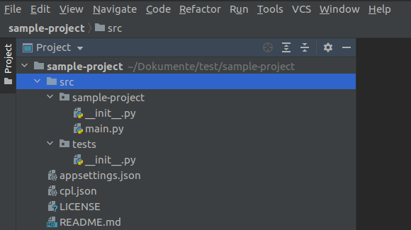
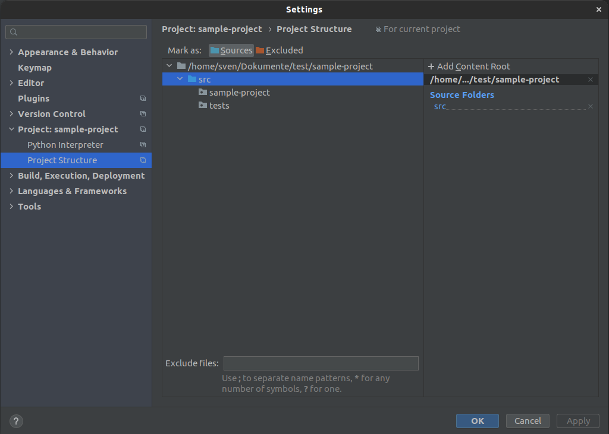
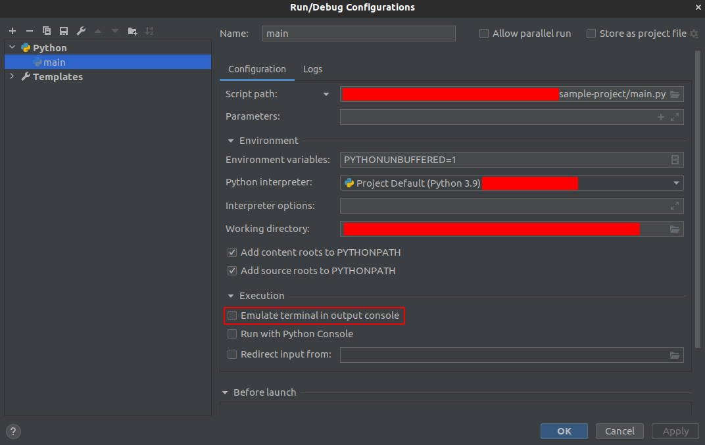

# Getting started with CPL

Welcome to CPL!

This tutorial introduces you to the essentials of the CPL package by walking through building an console based app.

## Table of Contents

1. [Prerequisites](#prerequisites)
2. [Create the project](#create-the-project)
3. [Create a menu](#create-a-menu)
4. [What's next](#whats-next)

## Prerequisites

To get most out of this tutorial you should already have a basic understanding of the following.

- [Python][python]

Also you need to have the following installed.

- [Python][python]
- [Pip][pip-url]
- [CPL](setup)
- [CPL-CLI](setup)

## Create the project

To create the sample project to the following:

1. Open a terminal
2. Run

    ```sh
    cpl new console sample-project
    ```

3. We don't want to use Application base or Dependency injection:

    ```sh
    Do you want to use application base? (y/n) n

    Do you want to use service providing? (y/n) n
    ```

    The ouput should look like this:

    ```sh
    Creating sample-project/LICENSE                                                                     done
    Creating sample-project/README.md                                                                   done
    Creating sample-project/src/tests/__init__.py                                                       done
    Creating sample-project/appsettings.json                                                            done
    Creating sample-project/src/sample-project/__init__.py                                              done
    Creating sample-project/src/sample-projectmain.py                                                   done
    ```

4. Open the project with an IDE like VS Code or PyCharm

    

5. Set the 'src' directory as source folder

    

6. Run the application

    You should see an output like:

    ```sh
    Hello World
    ```

7. In PyCharm you have to enable ```Emulate terminal in output console```!

    

## Create a menu

1. Open the 'sample-project/main.py'

2. Change 'Hello World' to 'Password generator:' in line 5

3. Add ```Console.select``` as follows:

    ```py
    from cpl_core.console import Console


    def main():
        Console.write_line('Password generator:')
        options = [
            'Only lower case',
            'Only upper case',
            'Lower and upper case'
            'Exit'
        ]
        option = Console.select('>', 'Select option: ', options)


    if __name__ == '__main__':
        main()
    
    ```

4. Get Id of the selected option:

    ```py
    index = options.index(option)
    ```

5. Create the generate function as follows:

    ```py
    def generate_password(letters: str, length: int) -> str:
        return ''.join(random.choice(letters) for i in range(length))
    ```

    Add imports:

    ```py
    import random
    import string
    ```

6. Get length of the password:

    ```py
    length = int(Console.read('Length: '))
    ```

7. Validate the selected option:

    ```py
    index = options.index(option)
    letters = ''
    
    if index == 0:
        letters = string.ascii_lowercase
    elif index == 1:
        letters = string.ascii_uppercase
    elif index == 2:
        letters = string.ascii_letters
    elif index == len(options) - 1:
        exit()
    ```

8. Print the generated password:

    ```py
    Console.write_line('Password: ', generate_password(letters, length))
    ```

9. The full 'sample-project/main.py':

    ```py
    import random
    import string

    from cpl_core.console import Console


    def generate_password(letters: str, length: int) -> str:
        return ''.join(random.choice(letters) for i in range(length))


    def main():
        Console.write_line('Password generator:')
        options = [
            'Only lower case',
            'Only upper case',
            'Lower and upper case',
            'Exit'
        ]
        option = Console.select('>', 'Select option: ', options)

        length = int(Console.read('Length: '))

        index = options.index(option)
        letters = ''
        if index == 0:
            letters = string.ascii_lowercase
        elif index == 1:
            letters = string.ascii_uppercase
        elif index == 2:
            letters = string.ascii_letters
        elif index == len(options) - 1:
            exit()

        Console.write_line('Password: ', generate_password(letters, length))


    if __name__ == '__main__':
        main()

    ```

## What's next

In this section, you've created an application that uses user input to generate a password.

To continue exploring CPL and developing applications:

- [Application base](cpl_core.application)
- [Dependency injection](cpl_core.dependency_injection)
- [Console](cpl_core.console)

<!-- LINKS -->
[pip-url]: https://pip.sh-edraft.de
[python]: https://www.python.org/
[pip]: https://pypi.org/project/pip/
